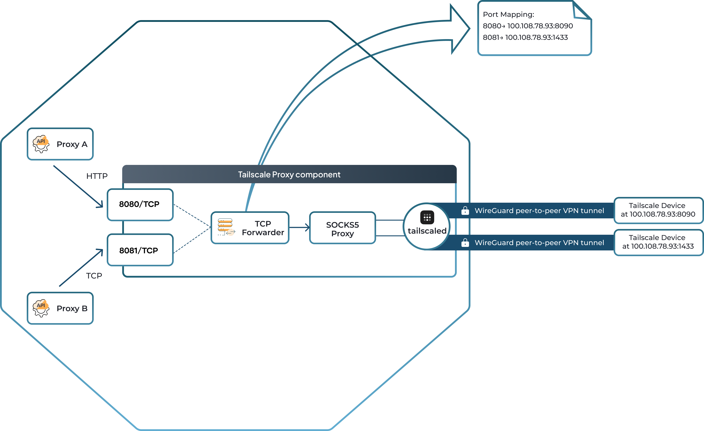
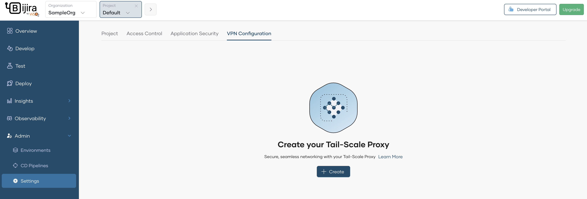
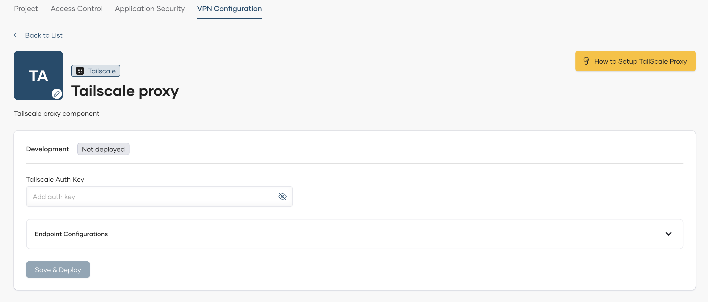
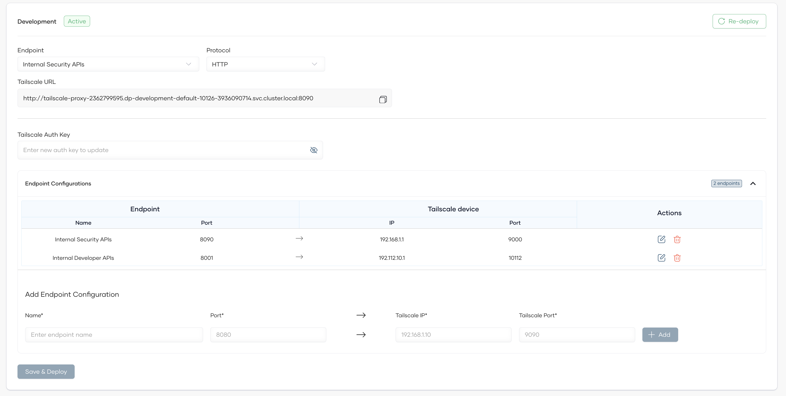

# Configure VPNs on the Bijira Cloud Data Plane

Secure access to private networks from the Bijira cloud data plane is an essential use case for cloud data plane users.

Bijira allows this secure connection using [Tailscale](https://tailscale.com/). For this, Bijira provides a prebuilt Tailscale image component that can act as a forward proxy, which you can deploy in your Bijira project. This tailscale deployment allows you to forward traffic to your external networks via Tailscale’s peer-to-peer [WireGuard](https://tailscale.com/kb/1035/wireguard) network.

The following diagram illustrates the high-level deployment architecture of the Tailscale pre-installed forward proxy:

Let's take a look at the specifics of each part to understand the deployment architecture.

- **Bijira project**

    In Bijira, a project groups API Proxies and MCP Servers. For more information on what a project in Bijira is, see the documentation on [Project](../../bijira-concepts/project.md).

- **Tailscale proxy**

    This acts as the Tailscale pre-installed forward proxy, facilitating secure peer-to-peer WireGuard connections from the Bijira cloud data plane to private networks. It includes a [Tailscale Daemon](https://tailscale.com/kb/1278/tailscaled), [SOCKS5 proxy](https://tailscale.com/kb/1112/userspace-networking#socks5-vs-http), and a configurable TCP forwarder.

  - **Tailscale daemon**

    This is the core component of Tailscale. It is a software service that provides secure network connectivity and private networking solutions. For more details see the [Tailscale documentation](https://tailscale.com/kb/1278/tailscaled).

  - **SOCKS5 proxy**

    This uses Tailscale’s [userspace networking](https://tailscale.com/kb/1112/userspace-networking) mode, rather than the kernel mode. Therefore, the inbuilt SOCKS5 proxy handles the forwarded traffic and directs it through the Tailscale network.

  - **TCP forwarder**

    Forwards inbound TCP (transmission control protocol) traffic from the Tailscale proxy container’s network interface to the SOCKS5 proxy, ensuring it reaches its destination via the secured WireGuard tunnel.

- **API Proxies and Bijira API gateway**

    API proxies within the same project as the Tailscale proxy can send their traffic to the ports exposed on the Tailscale proxy. The Tailscale proxy then forwards this traffic to the correct target node and IP address in your Tailscale network that is defined in the port mapping of the endpoint configuration

Now that you understand the deployment architecture, let’s explore how you can use Tailscale to secure connections to your private networks.

## Configure and use Tailscale to access private network endpoints

This section walks you through the steps to create, configure, deploy, and use the Tailscale proxy component.

### Prerequisites

- Understand the basics of [how Tailscale works](https://tailscale.com/blog/how-tailscale-works).
- Have a Tailscale account (Tailnet). There are multiple plans available for you to set up your Tailscale network. For details, see [Tailscale plans](https://tailscale.com/pricing).
- Install Tailscale and connect your private data center or server to it, so that your private services are accessible via your Tailscale network. To quickly get started with Tailscale, see the [Tailscale quickstart](https://tailscale.com/kb/1017/install).

### Step 1: Create the Tailscale proxy component

1.  Sign in to the [Bijira Console](https://console.bijira.dev/).
2.  In the Bijira Console top navigation menu, select the **Organization**, and then the **Project**.
3.  On the project home page, click **Admin** menu, and select the **Settings** sub menu.
4.  Click on the VPN Configuration tab and then click the Create button

5.  Enter a name, identifier, and a description for the tailscale proxy. For this guide, let's enter the following values:

    | Field                  | Value                     |
    | ---------------------- | ------------------------- |
    | Name | Tailscale proxy           |
    | Identifier   | tailscale-proxy           |
    | Description            | Tailscale proxy component |

8.  Click **Create**.

Now you have successfully created the Tailscale proxy. You can proceed to configure and deploy it.

### Step 2: Configure and deploy the Tailscale proxy

Here, you will set the Tailscale authentication key, configure endpoints, and deploy the Tailscale proxy.

Follow the steps given below:

#### Step 2.1: Configure and deploy the Tailscale proxy

To configure and deploy the tailscale proxy, follow the steps given below:

  1. Enter Your Tailscale Auth Key

    To connect your system to Tailscale, you need an **Auth Key**. Follow the steps below to generate one:

    - Visit the Tailscale Admin Keys page: [https://login.tailscale.com/admin/settings/keys](https://login.tailscale.com/admin/settings/keys)  
    - Click on the **Generate Auth Key** button to create a new key.

    !!! note
              When generating an Auth Key, you can configure various properties such as expiration, reusability, and ephemeral settings. For detailed guidance, refer to the official Tailscale documentation: [Auth Keys Guide](https://tailscale.com/kb/1085/auth-keys#generate-an-auth-key)

  2. Configure Endpoints

    To forward traffic from the Tailscale proxy to external devices, follow these steps:

    i. Identify the external Tailscale device (node) and port that you want to make accessible via the Tailscale proxy. You can view your Tailscale devices in the [Tailscale machines](https://login.tailscale.com/admin/machines) page.

      - Example: Device IP `192.168.1.1`, port `9000`.

    ii. In the "Add Endpoint Configuration" section of the Tailscale proxy interface, fill in the following fields:

      - **Endpoint Name:** A descriptive name for the endpoint (e.g., `Internal Security APIs`).  
      - **Port:** The port on the Tailscale proxy that will receive incoming API traffic (e.g., `8090`).  
      - **Target IP:** The IP address of the external device where the traffic should be forwarded (e.g., `192.168.1.1`).  
      - **Target Port:** The port on the external device that should receive the traffic (e.g., `9000`).

    iii. Click the **Add** button to save the endpoint and the port mapping.  

    iv. Repeat the process for any additional endpoints you want to configure.  

    #### Example Mappings

    - API Traffic sent to **port 8090** on the Tailscale proxy is forwarded to **port 9000** on the external tailscale node with IP **192.168.1.1**.  
    - API Traffic sent to **port 8001** on the Tailscale proxy is forwarded to **port 10112** on the external tailscale node with IP **192.112.10.1**.

    By completing these steps, you ensure that incoming traffic to the Tailscale proxy is properly routed to the intended external devices and ports.

7.  Click **Save & Deploy** to apply configurations and deploy the tailscale proxy.

!!! note
    When the Tailscale proxy is deployed, you can observe a new node connected to your Tailscale network. To view this, go to the [Tailscale machines](https://login.tailscale.com/admin/machines) page of your Tailscale coordination server.

!!! note
     You can configure multiple endpoints and port mappings on the same Tailscale device, and also across multiple Tailscale devices. This allows you to forward traffic from different ports to different external devices as needed.

### Step 3: Configure API Proxy to forward traffic to Tailscale proxy

After the deployment is complete, the Tailscale proxy URL will be displayed in the environment view.

  1. From the dropdown menus, select the desired Endpoint and Protocol (HTTP or HTTPS).

  2. The Tailscale URL will automatically update based on your selections.

  3. Copy the generated URL and set it as the target endpoint in your API proxy's configuration. This will route the API traffic through the Tailscale proxy.

## Post-deployment actions

### Handle node key expiry

Tailscale nodes have a default [node key](https://tailscale.com/kb/1010/node-keys) expiry time of 180 days. Nodes require re-authentication after key expiry to avoid connection losses and application downtime. There is an option to disable node key expiry if necessary. For more details, see [Node key expiry documentation](https://tailscale.com/kb/1028/key-expiry).

### Handle auth key expiry

[Auth keys](https://tailscale.com/kb/1085/auth-keys) are used to register new nodes into your Tailscale network. The default [expiry time for auth keys](https://tailscale.com/kb/1085/auth-keys#key-expiry) is 90 days, but nodes remain connected even after auth key expiry. This becomes an issue only if the Tailscale Proxy component is redeployed or restarted.

### Update port mapping configurations

If you want to add a new private endpoint to your network and access it via the same Tailscale proxy within Bijira, you must add a new port mapping entry in the endpoint configuration of your Tailscale proxy deployment.

## Best practices

### Use Tailscale ACLs

You can use [Tailscale ACLs](https://tailscale.com/kb/1018/acls) to precisely manage permission for users and devices on your Tailnet.

## Security best practices

Before deploying the Tailscale proxy in production environments, it is recommended to follow the Tailscale [production best practices](https://tailscale.com/kb/1300/production-best-practices) and [security best practices](https://tailscale.com/kb/1196/security-hardening).

!!! note
    Bijira blocks incoming connections from other nodes in your Tailnet to the Tailscale proxy to prevent access to your project’s namespace in the Bijira cloud data plane.
