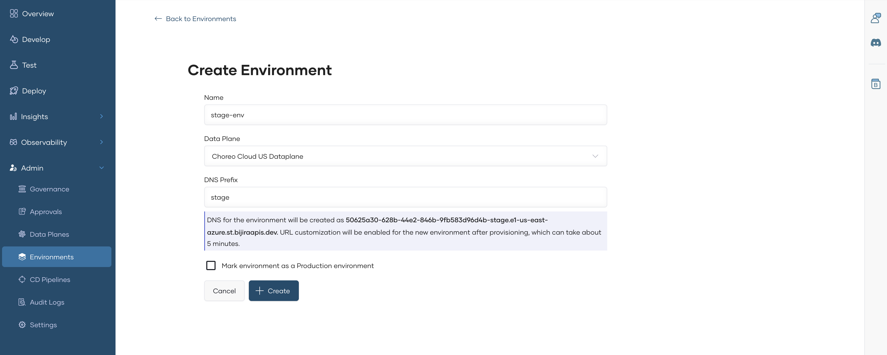

# Manage Environments

By default, all projects created in the cloud data planes (irrespective of the data plane region) are provisioned with two environments (i.e., development and production).

The environments are listed in the order of deployment and promotion. The initial deployment takes place in the first environment and you can proceed to promote a component to subsequent environments.

## Create a new environment

To create a new environment, follow the steps given below:

1. Sign in to [Bijira](https://console.bijira.dev/).
2. In the Bijira Console, go to the top navigation menu and click **Organization**. Then select your organization.
3. In the left navigation menu, click **Admin** and then click **Environments**.
4. On the **Environments** page, click **Create** and specify the following details to create a new environment:

   - **Name**: A display name for the new environment.
   - **Data Plane** - The data plane to create the new environment.

!!!tip
     The **Data Plane** list displays all the private data planes registered under your organization.

   - **DNS Prefix**: A DNS prefix to identify the exposed APIs in the environment. Here, the base domain depends on the custom domain attached to the API gateways provisioned on the selected data plane.
   - **Mark environment as a Production environment**: Select if you want this environment to be a production environment.

!!!tip
     In Bijira, you can have multiple non-production and production environments. To work in a production environment, you must have privileged permissions to access and deploy to production environments.

## Delete an environment

To delete an environment, follow the steps given below:

!!! warning
    Environment deletion is a permanent, non-reversible operation.

1. Sign in to [Bijira](https://console.bijira.dev/).
2. In the Bijira Console, go to the top navigation menu and click **Organization**. Then select your organization.
3. In the left navigation menu, click **Admin** and then click **Environments**.
4. In the **Environments** list, click the delete icon corresponding to the environment you want to delete. This displays a confirmation dialog with details on the impact of deletion.
5. Review the details, then type the environment name to confirm the deletion.
6. Click **Delete**.
