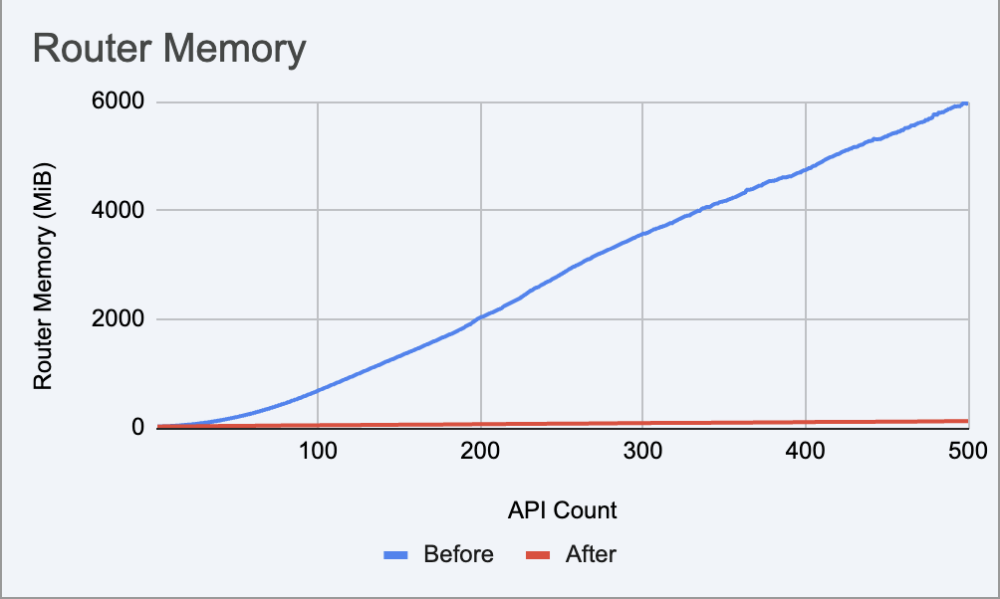
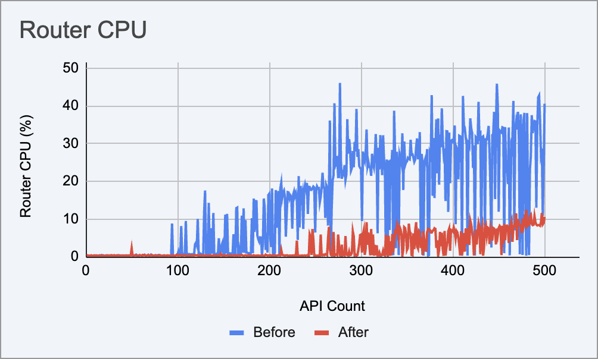
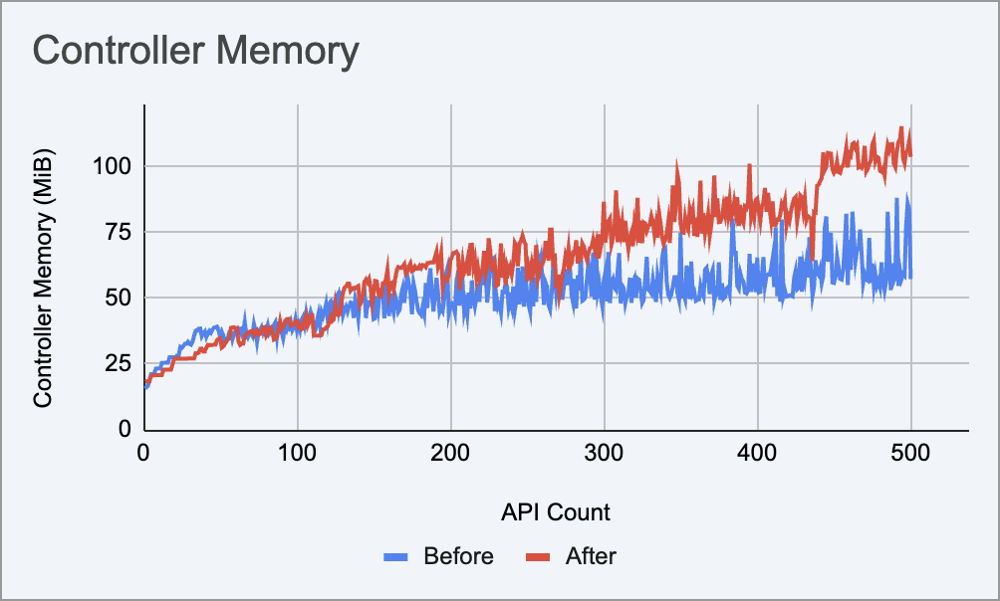
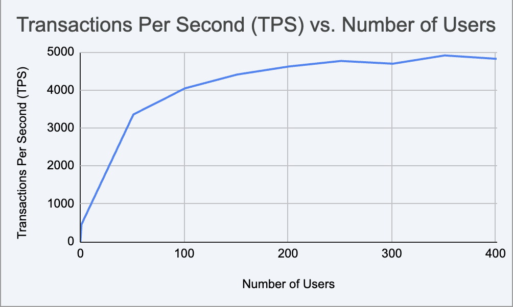

# Scalability and Performance Test Results

This page presents the results of scalability and load tests conducted on the API Platform. The tests cover two areas:

- **Scalability tests** — how gateway component resource usage (CPU and memory) changes as the number of deployed APIs grows from 1 to 500.
- **Load tests** — how the gateway performs under increasing concurrent user load, measured in transactions per second (TPS) and average response time.

All API creation requests across all test runs returned HTTP 201, confirming a **100% success rate**.

## Test Deployment Details

Tests were executed on the following infrastructure:

| Component | Instance Type | vCPU | Memory |
|-----------|---------------|------|--------|
| Test Client | <!-- TODO: fill in --> | <!-- TODO --> | <!-- TODO --> |
| Kubernetes Node | <!-- TODO: fill in --> | <!-- TODO --> | <!-- TODO --> |

The following Kubernetes resource allocations were used for the API Platform Gateway during testing:

| Component | Memory Request | CPU Request | Memory Limit | CPU Limit |
|-----------|---------------|-------------|--------------|-----------|
| Router | <!-- TODO --> | <!-- TODO --> | <!-- TODO --> | <!-- TODO --> |
| Controller | <!-- TODO --> | <!-- TODO --> | <!-- TODO --> | <!-- TODO --> |
| Policy Engine | <!-- TODO --> | <!-- TODO --> | <!-- TODO --> | <!-- TODO --> |

The following gateway components were monitored during scalability tests:

| Component | Description |
|-----------|-------------|
| **Router** | Handles inbound API traffic and proxies requests to backends |
| **Controller** | Manages API configurations and synchronizes state to the router |
| **Policy Engine** | Enforces API policies such as rate limiting and authentication |

## Scalability Tests

Scalability tests were conducted by sequentially creating APIs one at a time and recording the CPU and memory usage of each gateway component after each creation. Results are shown for two runs: one before an optimization was applied, and one after.

### Router

The most significant impact of the optimization was on router memory. Before the fix, memory grew unboundedly from **28.1 MiB to 5.83 GiB** as route configuration accumulated without being released. After the fix, memory stays under **124 MiB** across all 500 APIs.

| API Count | Before — CPU (%) | Before — Memory | After — CPU (%) | After — Memory |
|-----------|-----------------|-----------------|-----------------|----------------|
| 1 | 0.28 | 28.10 MiB | 0.27 | 25.09 MiB |
| 100 | 0.48 | 680.2 MiB | 0.36 | 47.45 MiB |
| 200 | 16.73 | 1.98 GiB | 0.33 | 67.49 MiB |
| 300 | 23.24 | 3.49 GiB | 5.89 | 87.52 MiB |
| 400 | 30.51 | 4.63 GiB | 6.68 | 103.6 MiB |
| 500 | 40.56 | 5.83 GiB | 10.57 | 123.7 MiB |

Router CPU also improved significantly, as shown below.

| Metric | Before | After | Improvement |
|--------|--------|-------|-------------|
| Memory at 500 APIs | 5.83 GiB | 123.7 MiB | −97.9% |
| Memory growth rate | ~11.9 MiB/API | ~0.20 MiB/API | −98.3% |
| Peak CPU | 46.07% (at 277 APIs) | 12.45% (at 480 APIs) | −73% |

### Controller

Controller resource usage remained modest in both runs, though memory grew slightly after the optimization due to the controller taking on additional configuration responsibilities.

| API Count | Before — CPU (%) | Before — Memory | After — CPU (%) | After — Memory |
|-----------|-----------------|-----------------|-----------------|----------------|
| 1 | 0.00 | 15.69 MiB | 0.00 | 18.34 MiB |
| 100 | 0.00 | 37.99 MiB | 0.00 | 41.35 MiB |
| 200 | 0.00 | 47.04 MiB | 0.00 | 64.54 MiB |
| 300 | 0.00 | 56.91 MiB | 0.02 | 86.79 MiB |
| 400 | 0.00 | 65.59 MiB | 0.00 | 87.96 MiB |
| 500 | 0.00 | 57.34 MiB | 0.00 | 103.8 MiB |

- Peak controller CPU: **6.28%** before optimization, **0.36%** after.

### Policy Engine

The policy engine's resource usage is effectively flat in both runs, confirming it has no overhead associated with API count scaling.

| API Count | Before — CPU (%) | Before — Memory | After — CPU (%) | After — Memory |
|-----------|-----------------|-----------------|-----------------|----------------|
| 1 | 0.00 | 31.33 MiB | 0.03 | 10.83 MiB |
| 100 | 0.00 | 54.12 MiB | 0.03 | 11.79 MiB |
| 200 | 0.00 | 56.43 MiB | 0.02 | 11.79 MiB |
| 300 | 0.00 | 53.77 MiB | 0.05 | 11.79 MiB |
| 400 | 0.00 | 55.29 MiB | 0.10 | 11.79 MiB |
| 500 | 0.00 | 54.85 MiB | 0.05 | 11.79 MiB |

## Load Test Results

Load tests measured the gateway's throughput (TPS) and average response time as concurrent users increased from 1 to 401. A secured API backed by an echo service was used as the test target.

| Concurrent Users | Throughput (TPS) | Avg Response Time (ms) | Error Rate (%) |
|-----------------|-----------------|------------------------|----------------|
| 1 | 454.79 | 2.1 | 0.00 |
| 101 | 4,045.35 | 20.8 | 0.00 |
| 201 | 4,619.13 | 36.3 | 0.00 |
| 301 | 4,691.80 | 53.5 | 0.00 |
| 401 | 4,820.31 | 70.3 | 0.00 |

- **Peak throughput: 4,910.02 TPS** at 351 concurrent users.
- Throughput plateaus in the **4,600–4,910 TPS** range beyond 200 users.
- Response time increases linearly from **2.1 ms** at 1 user to **70.3 ms** at 401 users.
- **Zero errors** across all load levels.

## Summary

### Scalability

| Metric | Before Optimization | After Optimization | Improvement |
|--------|--------------------|--------------------|-------------|
| Router memory at 500 APIs | 5.83 GiB | 123.7 MiB | −97.9% |
| Peak router CPU | 46.07% | 12.45% | −73% |
| Peak controller CPU | 6.28% | 0.36% | −94% |
| API creation success rate | 100% | 100% | — |

### Load

| Metric | Value |
|--------|-------|
| Peak throughput | 4,910.02 TPS (at 351 users) |
| Min response time | 2.1 ms (at 1 user) |
| Max response time | 70.3 ms (at 401 users) |
| Error rate | 0.00% across all load levels |
