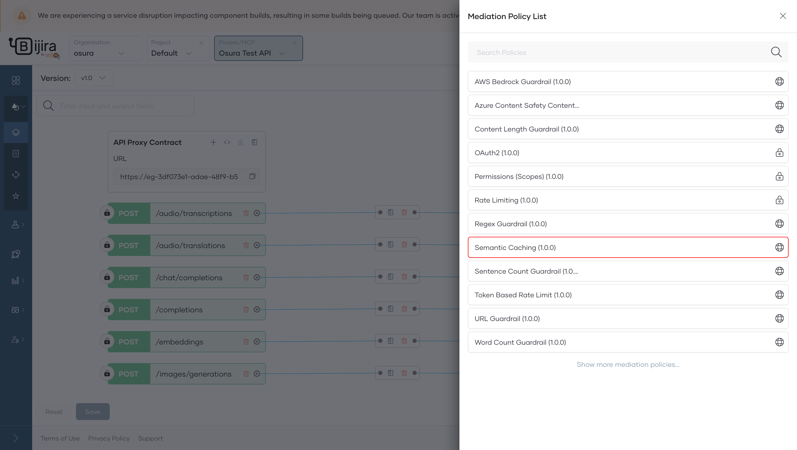

# Semantic Caching

AI services frequently involve repetitive queries, leading to unnecessary token usage and increased latency. Bijira’s AI Gateway introduces semantic caching, allowing responses to similar requests to be cached and reused intelligently, minimizing redundant processing, improving response times, and reducing overall costs.


## Configure Semantic Caching Policy

1. In the left navigation menu, click **Develop**, then select **Policy**. 

      

2. Click Add Resource Level Policy --> Request flow --> Attach mediation policy --> Semantic Caching

      

3. Add the embedding provider and vector store configurations and click **Save**.

       

4. **Save** the API and **Deploy** the API to apply the policy to the gateway.

The configurable fields of the above policy have been described below.

| Field                    | Description                                                        | Example Value                |
| ------------------------ | ------------------------------------------------------------------ | --------------------------- |
| `Embedding Provider`     | AI provider used for generating embeddings (Azure OpenAI or Mistral).| `Azure OpenAI`              |
| `Auth Header Name`       | Header name for authentication <br>(<i>Use the header name ```Authorization``` for Mistral and ```api-key``` for Azure OpenAI.</i>).         | `api-key`             |
| `API Key`                | API key for authenticating with the embedding provider.            | `49fdadxxxxxxxxxxxxxxxxxxxxxxxxxx`       |
| `Embedding Model Name`   | Specific embedding model to use from the provider.                 | `text-embedding-ada-002`    |
| `Embedding Upstream URL` | Endpoint URL of the embedding service.                             | `https://example.openai.azure.com/openai/deployments/xxxxx/embeddings?api-version=2025-07-21` |
| `Vector Store`           | Type of vector database to store embeddings <br><i>(Currently only Redis is supported)</i>.     | `Redis`                     |
| `Host`                   | Host address of the vector database.                               | `redis-xxxxx.us-east.ec2.redis-cloud.com`                 |
| `Port`                   | Network port number of the vector database.                        | `6379`                      |
| `Dimensions`             | The dimensionality of the vectors generated from the selected embedding model. (<i>Refer to the provider's official documentation to find out the exact values</i>).                        | `1536`                      |
| `Threshold`              | Dissimilarity threshold which is a decimal value for semantic matching that determines the required similarity for cache matches. <br>[<i>**Note**: Lower values (closer to 0) enforce stricter semantic similarity, while higher values allow weaker matches. Typical range: 0.0 (exact) to higher values (e.g., 0.5, 1.2, etc.</i>)]. | `0.1`                       |
| `Username`               | Username for database authentication.                              | `newuser`                     |
| `Password`               | Password for the specified database user.                          | `securepassword123`         |
| `Database`               | Index of the vector database to connect to.                         | `0`             |

## Sample Payloads and Responses

First Request:

=== "Sample Payload"
    ```json
    {
      "messages": [
        {
          "role": "system",
          "content": "How do I reset my google account password?"
        }
      ]
    }
    ```

=== "Sample Response Headers and Body"
    ```bash
    < HTTP/2 200
    < content-type: application/json
    < x-cache-status: MISS
    < server: envoy
    <
    {"choices":[{"content_filter_results":{"hate":{"filtered":false,"severity":"safe"},"self_harm":{"filtered":false,"severity":"safe"},"sexual":{"filtered":false,"severity":"safe"},"violence":{"filtered":false,"severity":"safe"}},"finish_reason":"stop","index":0,"logprobs":null,"message":{"content":"You can reset your Google account password by following these steps:\n\n1. Go to the Google account recovery page: https://accounts.google.com/signin/recovery.\n\n2. Enter your email address associated with your Google account and click on \"Next.\"\n\n3. You will be prompted to enter the last password you remember. If you don't remember any, click on \"Try another way.\"\n\n4. Google will send a verification code to your recovery email address or phone number. Enter the code when prompted.\n\n5. Once your identity is verified, you will be able to create a new password for your Google account.\n\n6. Enter the new password, confirm it, and click on \"Change Password.\"\n\nYour Google account password should now be reset successfully.","role":"assistant"}}],"created":1753434513,"id":"chatcmpl-Bx8hlwkW0SGNRSaR1BoVoNYpK5aTr","model":"gpt-3.5-turbo-0125","object":"chat.completion","prompt_filter_results":[{"prompt_index":0,"content_filter_results":{}}],"system_fingerprint":"fp_0165350fbb","usage":{"completion_tokens":149,"prompt_tokens":16,"total_tokens":165}}

    ```


Second Request:

=== "Sample Payload"
    ```json
    {
      "messages": [
        {
          "role": "system",
          "content": "What is the process for changing my google login password?"
        }
      ]
    }

    ```

=== "Sample Response Headers and Body"
    ```bash

      < HTTP/2 200
      < content-type: application/json
      < x-cache-status: HIT
      < server: envoy
      <
      {"choices":[{"content_filter_results":{"hate":{"filtered":false,"severity":"safe"},"self_harm":{"filtered":false,"severity":"safe"},"sexual":{"filtered":false,"severity":"safe"},"violence":{"filtered":false,"severity":"safe"}},"finish_reason":"stop","index":0,"logprobs":null,"message":{"content":"You can reset your Google account password by following these steps:\n\n1. Go to the Google account recovery page: https://accounts.google.com/signin/recovery.\n\n2. Enter your email address associated with your Google account and click on \"Next.\"\n\n3. You will be prompted to enter the last password you remember. If you don't remember any, click on \"Try another way.\"\n\n4. Google will send a verification code to your recovery email address or phone number. Enter the code when prompted.\n\n5. Once your identity is verified, you will be able to create a new password for your Google account.\n\n6. Enter the new password, confirm it, and click on \"Change Password.\"\n\nYour Google account password should now be reset successfully.","role":"assistant"}}],"created":1753434513,"id":"chatcmpl-Bx8hlwkW0SGNRSaR1BoVoNYpK5aTr","model":"gpt-3.5-turbo-0125","object":"chat.completion","prompt_filter_results":[{"content_filter_results":{},"prompt_index":0}],"system_fingerprint":"fp_0165350fbb","usage":{"completion_tokens":149,"prompt_tokens":16,"total_tokens":165}}

    ```


<html><div class="admonition note">
      <p class="admonition-title">Note</p>
      <p>The effectiveness of semantic caching can vary based on the selected <code>embedding model</code> and configured <code>similarity threshold</code>. Ensure optimal performance by carefully selecting these parameters according to your specific use case.</p>
      </div>
</html>

  
## Next Steps

- **Verify** it is properly redeployed to ensure the policy and the configurations are properly applied.  

- **Test the AI API** to ensure it properly cache and serves those cached responses upon receiving semantically similar queries. See [Test REST Endpoints via the OpenAPI Console](../../test-api-proxy/openapi-console.md).  
 

By configuring semantic caching as outlined above, you can efficiently optimize AI service usage within your Bijira environment, significantly reducing latency and operational costs.
  
