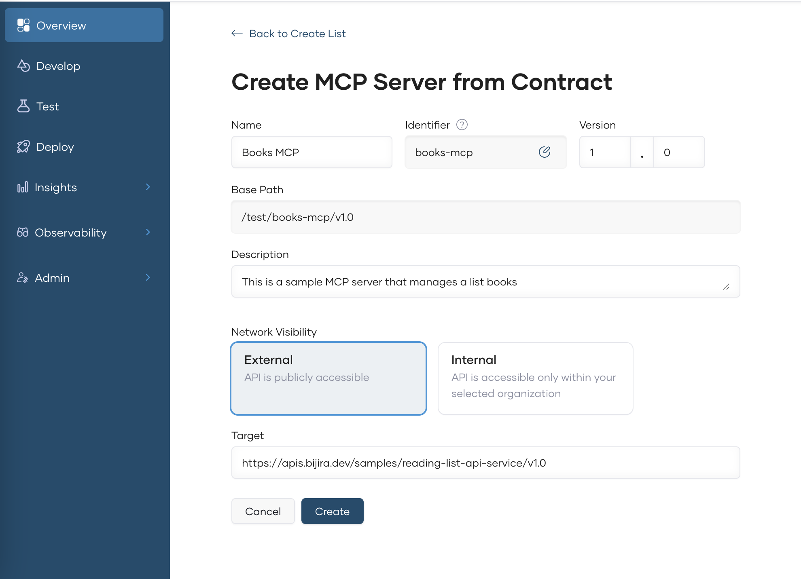
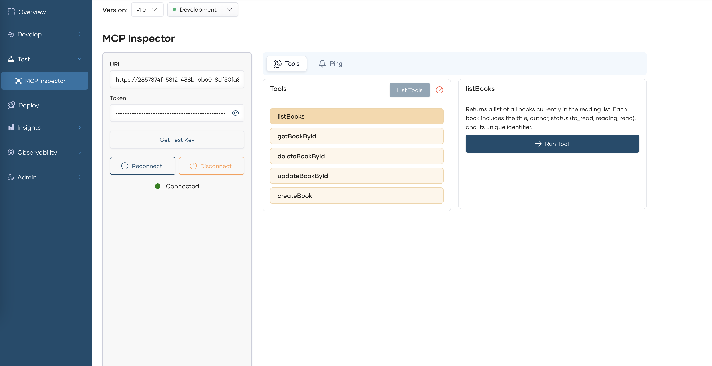
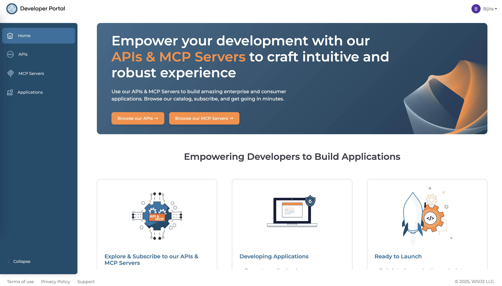
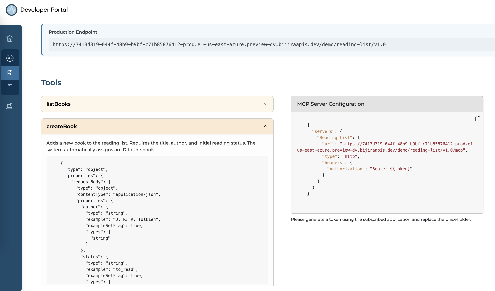

# Design and Publish MCP Servers

## Prerequisites

### Create an Organization

If you're signing in to the Bijira Console for the first time, create an organization.

1. Go to [Bijira Console](https://console.bijira.dev/) and sign in using your Google, GitHub, or Microsoft account.
2. Enter a unique organization name.
3. Read and accept the privacy policy and terms of use.
4. Click **Create**.

This creates the organization and opens the organization home page.

### Create a Project

1. Go to [Bijira Console](https://console.bijira.dev/) and sign in. This opens the organization home page.
2. On the organization home page, click **+ Create Project**.
3. Enter the following details:

    !!! info
        The **Name** field must be unique and cannot be changed after creation.

    | **Field**        | **Value**         |
    | ---------------- | ----------------- |
    | **Display Name** | Sample Project    |
    | **Identifier**   | sample-project    |
    | **Description**  | My sample project |

4. Click **Create**. This creates the project and takes you to the project home page.

## Create an MCP Server

Bijira provides two ways of creating MCP Servers. On the project home page, select **MCP Server** to view the available options.

### MCP Servers for HTTP backends

This option lets you create an MCP Server based on any HTTP API you have.

### MCP Servers for existing API Proxies

If you select **Start from Existing Proxy**, you will get the following view. Here, you will get the option to select an existing API Proxy in Bijira.

!!!important
    Although the MCP Server is associated with the API Proxy, their lifecycles are not tightly coupled. As a result, unpublishing or undeploying the API Proxy can disrupt the MCP Server created using it, so it’s important to manage these actions carefully.

## Modify Tools of your MCP Server

You can modify the details of the Tools of your generated MCP Server by navigating to the *Policy* section under the *Develop* menu. The default tool names and descriptions are generated by Bijira based on the information available in the API contract.

The following options are supported when modifying the Tools

1. **Add new Tool** - You can create a new tool by selecting the **+** icon at the top. You have to provide the name and description at this stage. The schema will be auto generated once  you create the mapping to the REST resource
2. **Edit Tool details** - You can modify the tool name and description of each tool by clicking on the Tool icon. The tool schema cannot be modified.
3. **Delete Tools** - By default tools are created for all the resources of the API proxy or the backend service. You can remove unwanted ones by      deleting the tool.

!!!tip
    Clear and well-defined tool names and descriptions make it easier for LLMs to recognize and use the tools effectively. If the auto-generated versions don’t meet your needs, you should feel free to customize them to better suit your use case.

You have to **redeploy** the MCP Server after saving for the new changes to be reflected in the gateway.

## Test the MCP Server

You can test the MCP Server in the development environment before promoting it to production. Bijira provides its own version of **MCP Inspector** for this purpose.

!!!info
        Tool calling via the MCP Inspector is currently not supported for MCP Servers created from existing APIs.

1. Select **MCP Inspector** under the Test section.
2. Select Development from the environment drop-down list (If you have deployed the API to other environments, you can select the respective options as well).
3. Click on **Get Test Key** if the test key is not populated
4. Click on **Connect** to connect with your deployed MCP Server.

    !!!info
        This will send an **Initialize** call to the MCP Server deployed in the gateway and establish a connection to the server.

    

5. You can select and call individual tools by providing the parameters if necessary.

## Publish the MCP Server

Once you verify that the MCP Server is working as expected in the development environment, you can promote it to production.

1. In the left navigation menu, click **Deploy**.
2. In the Development card, click **Promote**.
3. In the Configuration Types pane, select the option Use Development endpoint configuration and click Next.

The Production card indicates the Deployment Status as Active when the MCP Server is successfully deployed to production.

If you want to verify that the MCP Server is working as expected in production, you can test the API in the production environment using the inbuilt MCP Inspector.

Now that your MCP Server is deployed in both development and production environments and can be invoked, the next step is to publish it so that consumers can discover and subscribe to it.

1. In the left navigation menu, click **Develop** and then click **Lifecycle**. This opens the Lifecycle page, where you can see the different lifecycle stages of the MCP Server. The default lifecycle stage is Created.
2. Click **Publish**.
3. In the Publish MCP Server dialog, click Confirm to proceed with publishing the MCP Server with the specified display name. If you want to change the display name, make the necessary changes and then click Confirm. This changes the lifecycle state to **Published**.

## Discover MCP Servers through Developer Portal

You can view the published MCP Server via the Developer Portal.

In the Lifecycle Management pane, click **Go to DevPortal**. This takes you to the MCP Server published to the Bijira Developer Portal.

!!!info
    If you need to do MCP specific customization to the Developer portal, please refer the [MCP Hub documentation](./devportal-mcp-hub.md).

Go to the MCP Server listing page using the left navigation menu and select your MCP Server

!!!info
    The MCP Server url is shown as the **Production Endpoint** in the overview.

MCP consumers can discover the available tools through this view. Additionally, sample configurations for setting up the MCP Server with an MCP Client can also be obtained from here.

## Connect the MCP Server with MCP Clients / AI Agents

MCP Servers in Bijira are secured by default. To access them, you must subscribe through an application, obtain a valid token, and configure it in your MCP client.

For more information regarding managing applications, please refer [this](../devportal/manage-applications/create-an-application.md).

Please refer [this section](../devportal/manage-subscriptions/subscribe-to-an-api.md) to get an idea on how you can manage subscriptions to an application. Subscribing to MCP Servers is similar to how you subscribe to API Proxies.

!!!important
    If you created the MCP Server using an existing API Proxy, you need to subscribe to both using the same application.

Once you have the subscriptions in place, you need a valid OAuth2 token to connect with the MCP Server. You can refer to the [Generate Keys](../devportal/consuming-services/consume-an-api-secured-with-oauth2.md#generate-keys) section to get more information on how you can obtain a token.

If you are using **VS Code Copilot Agent** to test this out, you can copy the MCP Server Configuration from the overview and add that as a server configuration in [VS Code’s mcp.json](https://code.visualstudio.com/docs/copilot/chat/mcp-servers).

1. Replace the placeholder with the token you generated in the previous step.
2. Start the server through VSCode. If everything runs smoothly, it will connect within a few seconds and automatically detect the MCP Tools exposed by your MCP Server.
3. Now you can try out the tools through the chat option in copilot.

!!!important
    If you are using another AI Agent or an MCP Client, you need to configure the MCP server url (Production Endpoint) and set the authorization token appropriately.