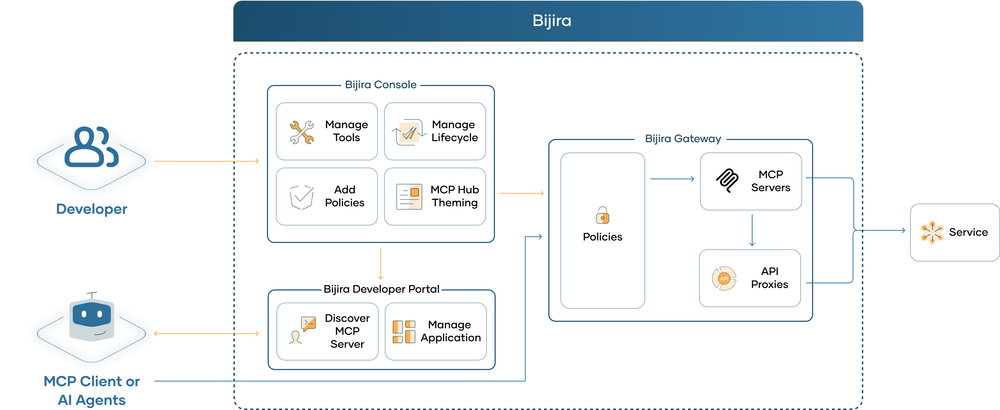

# Overview

## What is Model Context Protocol?

MCP is a JSON-RPC–based protocol designed to standardize how applications interact with large language models (LLMs). It enables sharing of contextual information—such as local files, databases, or APIs—with LLMs, while also allowing applications to expose tools and capabilities for AI-driven workflows and integrations.

MCP follows a host–client–server architecture and supports two primary transport mechanisms: stdio and streamable HTTP. While stdio is commonly used for local communication between clients and servers on the same machine, streamable HTTP is increasingly preferred for remote connections, especially as MCP adoption grows across networked environments. 

For more information, refer to the official [specification](https://modelcontextprotocol.io/introduction).

## Remote MCP Servers with Bijira

Bijira now includes support for MCP servers. It provides a complete solution for transforming existing APIs into intelligent, AI-ready tools. With a centralized control plane, Bijira simplifies the entire lifecycle of MCP server management—from creation to discovery—delivering a seamless experience for both API developers and AI agent builders. Additionally, Bijira allows you to customize the developer portal to deliver a tailored, MCP-only experience for your consumers.

In summary, Bijira provides the following capabilities related to MCP.

1. Create MCP Servers from existing API proxies or HTTP backends.
2. Automatically generate the MCP tool schemas.
3. Secure the MCP Servers with OAuth2 security.
4. Customize the Developer portal into an MCP Hub.

## MCP Use Cases with Bijira

- [Design and Publish MCP Servers for your APIs](design-mcp-servers.md)
- [Customize the Developer Portal to an MCP Hub](devportal-mcp-hub.md)

